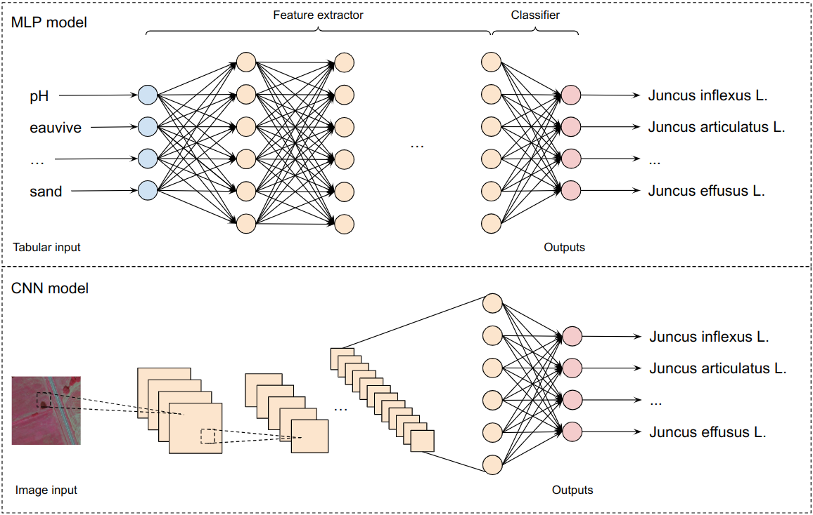
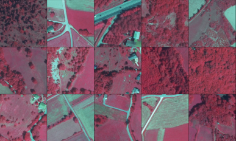

# Introduction to Deep Learning Methods for Multi-Species Predictions

> 📋 This repository is the official pytorch implementation for the paper **Introduction to Deep Learning Methods for Multi-Species Predictions**.



## Requirements

> 📋 To install requirements:
```setup
pip install -r requirements.txt
```

> 📋 To set up for the data:
- Download the datafile folder with this [link](https://drive.google.com/drive/folders/12SxquCwWwapfGeJEBHoB4qD1s7WQL3-R?usp=sharing).
- Download the filelist folder with this [link](https://drive.google.com/drive/folders/19vuAQpggCB5DIPB9RKW-HT-SL5y2_daE?usp=sharing).
- Download the Data folder with this [link](https://drive.google.com/drive/folders/16F0CdTKMjNyCPX-q6G69TpwSrO4YAjMX?usp=sharing).

## CBNA data 

> 📋 The IRC images (or patches) are stored in 'Data/irc_patches/' directory, some examples are shown as follows:



> and the train/val/test split files, as well as the overall species are stored in 'datafile/':
```data split and species
- train_w_covariates_final.csv: for model training (images for CNN and environmental covariates for MLP)
- val_w_covariates: for hyper-parameter tuning 
- test_w_covariates: for evaluation
- classes.txt: 2522 selected species for multi-species predictions
- stats_meta.pth: mean and std values of each environmental covariate, for normalization purpose 
```

> 💡 For MLP, we used the following environmental covariates = ['LANDOLT_MOIST',
       'N_prct', 'pH', 'CN', 'TMeanY', 'TSeason', 'PTotY', 'PSeason', 'RTotY',
       'RSeason', 'AMPL', 'LENGTH', 'eauvive', 'clay', 'silt', 'sand', 'cv_alti']

## Data preparation (Optional)

> 📋 This step shows how to obtain IRC images, as well as the train/val/test splits from scratch with 'export_cbna_20220414.csv' stored in 'filelist/': 
```preparation steps
1. Run preprocess_csv.ipynb until the obtaining of cbna_norepeat.csv file
2. Run extract_irc_patches.py using the command: python extract_irc_patches.py
3. Continue with preprocess_csv.ipynb till the end to obtain cbna_filtered.csv file
4. Run process_csv.ipynb till the end to obtain cbna_final_w_covariates.csv file
5. Run generate_train_val_test.ipynb till the end to obtain train/val/test split files
```

## Model training

> 📋 We provide the training code for 4 proposed neural network models (MLP, CNN, Fusion and ViT), the code structure is shown as follows:
```code structure
- train_cbna.py: code to train all proposed models
- dataset.py: code to create dataloaders
- datamgr.py: code for data augmentations
- samplers.py: code for creating costumized data samplers
- models.py: code containing all proposed models
- engine.py: code for evaluation on the test data
- utils.py: code for miscellaneous tasks
```

> To proceed the training for MLP, CNN and Fusion models, run: 
```train
torchrun --nproc_per_node=2 train_cbna.py --model_type MLP/CNN/Fusion --loss_fn focal/bce/dice
```

> for ViT model, run: 
```train ViT
torchrun --nproc_per_node=2 train_cbna.py --model_type ViT --ThreeAugment True --color_jitter 0.3 --clip_grad 1.0 --drop_path 0.1 --loss_fn focal/bce/dice
```

> To evaluate the trained model on test data, run:
```eval
torchrun --nproc_per_node=1 train_cbna.py --model_type MLP/CNN/Fusion/ViT --eval --threshold 0.5/0.45
```

> 🔍 The trained parameters for each model are stored in that model's corresponding directory (e.g. 'checkpoints/CBNA/CNN/best.pth'). In addition, per-species performances are reported for each model when launching the above evaluation code, they are also stored in the same model directory ('checkpoints/CBNA/CNN/CNN_tss_per_cls.csv'). All model related files can be downloaded from [here](https://drive.google.com/drive/folders/1M91LLtripPZqQ64TyC9ccQKi7_LBWnCG?usp=sharing).


## Performance

> 📋 Our models achieved the following performance on **CBNA**:

| Model name | loss function | global threshold | macro tss | micro tss |
| :----: | :----: | :----: | :----: | :----: |
| MLP | CB Focal Loss | 0.5 | 69.61% | 71.41% |
| CNN | CB Focal Loss | 0.45 | 69.67% | 75.24% |
| ViT | CB Focal Loss | 0.5 | 64.26% | 66.67% |
| Fusion | CB Focal Loss | 0.45 | **71.35%** | **76.87%** |

## Performance comparison with different loss functions for MLP

| Model name | loss function | global threshold | macro tss | micro tss |
| :----: | :----: | :----: | :----: | :----: |
| MLP | CB Focal Loss | 0.5 | 69.61% | 71.41% |
| MLP | Focal Loss | 0.5 | 62.92% | 71.30% |
| MLP | BCE | 0.5 | 7.90% | 17.40% |
| MLP | DICE | 0.5 | 0.56% | 5.40% |

> ✅ Run ``torchrun --nproc_per_node=1 train_cbna.py --model_type MLP/CNN/Fusion/ViT --loss_fn focal --weighted True`` for CB focal loss

> ✅ Run ``torchrun --nproc_per_node=1 train_cbna.py --model_type MLP/CNN/Fusion/ViT --loss_fn focal --weighted False`` for focal loss

> ✅ Run ``torchrun --nproc_per_node=1 train_cbna.py --model_type MLP/CNN/Fusion/ViT --loss_fn bce`` for (weighted) bce loss

> ✅ Run ``torchrun --nproc_per_node=1 train_cbna.py --model_type MLP/CNN/Fusion/ViT --loss_fn dice`` for dice loss

## Feature extraction

> 📋 To extract features from pretrained models as well as predictions and labels, run:
```extract
python extract_features.py --model_type MLP/CNN/Fusion/ViT --data_split train/test --get features/predictions
```

> 🔍 The extracted features/predictions for each model are stored in that model's corresponding directory (e.g. 'checkpoints/CBNA/CNN/CNN_train_features.pth')

## CNN visualization

```visu cnn
- visu_cnn_featuremaps.ipynb: illustrate the feature maps of hidden layers in the proposed CNN
- visu_cnn_gradcam.ipynb: illustrate the gradcam for a specific input image
- visu_cnn_clusters.ipynb: different feature dimension reduction methods (e.g. PCA, UMAP), clustering and cluster visualization
- visu_boxplot.ipynb: box_plots comparison for MLP, CNN and Fusion models 
```

## MLP visualization

```visu mlp
- visu_mlp_clusters: UMAP feature dimension reduction, clustering, cluster visualization and SHAP
```

## Thresholding

> 📋 The proposed method used global thresholding, meaning that we computed the TSS scores by using one threshold, fine-tuned using validation data, for all species. However, there exist other thresholding methods such as adaptive thresholding that uses the training data on trained models, in order to find an optimal threshold for each species. This method is presented in 'thresholding.ipynb'. And here we show the comparison of global thresholding and adaptive thresholding: 

| Model name | loss function | global threshold | macro tss | micro tss |
| :----: | :----: | :----: | :----: | :----: |
| MLP | CB Focal Loss | 0.5 | **69.61%** | **71.41%** |
| MLP | CB Focal Loss | Adaptive | 67.70% | 69.66% |
| CNN | CB Focal Loss | 0.45 | **69.67%** | **75.24%** |
| CNN | CB Focal Loss | Adaptive | 67.56% | 71.94% |
| Fusion | CB Focal Loss | 0.45 | **71.35%** | **76.87%** |
| Fusion | CB Focal Loss | Adaptive | 66.88% | 73.49% |

> 🔍 The adaptive thresholds for each model are stored in that model's corresponding directory (e.g. 'checkpoints/CBNA/MLP/thresholds_train.pth')

> ✅ run ``torchrun --nproc_per_node=1 train_cbna.py --model_type MLP/CNN/Fusion/ViT --eval --thres_method adaptive`` to obtain the performance using adaptive thresholding

## Calibration

```visu cnn
- Run calibration_isotonic.ipynb to perform isotonic calibration
- Run calibration_temperature_scaling.ipynb to perform temperature scaling
```

> 📋 The obtained performance using the above calibration methods are shown as follows:

| Model name | loss function | global threshold | calibration | macro tss | micro tss |
| :----: | :----: | :----: | :----: | :----: | :----: |
| MLP | CB Focal Loss | 0.5 | No | **69.61%** | 71.41% |
| MLP | CB Focal Loss | 0.01 | Isotonic | 55.26% | **77.09%** |
| MLP | CB Focal Loss | 0.5 | Temp scaling | 69.61% | 71.41% |
| CNN | CB Focal Loss | 0.45 | No | **69.67%** | 75.24% |
| CNN | CB Focal Loss | 0.01 | Isotonic | 56.59% | **77.95%** |
| CNN | CB Focal Loss | 0.45 | Temp scaling | 69.67% | 75.24% |

## Alps features and predictions extraction using trained MLP and CNN models

> 📋 Given 'proj_env_data.csv' stored in 'datafile/', we firstly selected the same environmental covariates as those that are used to train our MLP, namely ['LANDOLT_MOIST', 'N_prct', 'pH', 'CN', 'TMeanY', 'TSeason', 'PTotY', 'PSeason', 'RTotY', 'RSeason', 'AMPL', 'LENGTH', 'eauvive', 'clay', 'silt', 'sand']. Then run the following command:
```extract alps 
python extract_alps_features.py --model_type MLP/CNN
```

> ❗ There is no 'cv_alt' in the 'proj_env_data.csv', so we trained another MLP model without this variable just to accommodate the extraction of alps features. This newly trained model is stored in 'checkpoints/CBNA/MLP/wo_alt/' directory.

> 🔍 There are a total of 4,320,348 = 636 x 6793 observations in Alps data. Given the huge quantity, in extract_alps_features.py we set the batch size to 636 and conduct the extraction per batch. Therefore we have a total of 6793 files, each containing the extracted features and predictions for a data batch. The extractions are stored in either 'checkpoints/CBNA/alps_MLP/' or 'checkpoints/CBNA/alps_CNN/'

## For the future work:

```explore
1. The over-prediction problem caused by the weighted loss function
2. Better ViT model structures and training stragies to boost their performance
3. Integration with other works using the extracted features / predictions and see if there could be improvement
4. More advanced fusion technique to maximize the benefit of both image and tabular data
```

## Reference:

[DeiT III: Revenge of the ViT](https://arxiv.org/pdf/2204.07118.pdf)

[ResNet strikes back: An improved training procedure in timm](https://arxiv.org/pdf/2110.00476.pdf)

[Focal Loss for Dense Object Detection](https://arxiv.org/pdf/1708.02002.pdf)

[Class-Balanced Loss Based on Effective Number of Samples](https://arxiv.org/pdf/1901.05555.pdf)

[Grad-CAM: Visual Explanations from Deep Networks via Gradient-based Localization](https://arxiv.org/pdf/1610.02391.pdf)

[A Unified Approach to Interpreting Model Predictions](https://arxiv.org/pdf/1705.07874.pdf)

[Generalised Dice overlap as a deep learning loss function for highly unbalanced segmentations](https://arxiv.org/pdf/1707.03237.pdf)